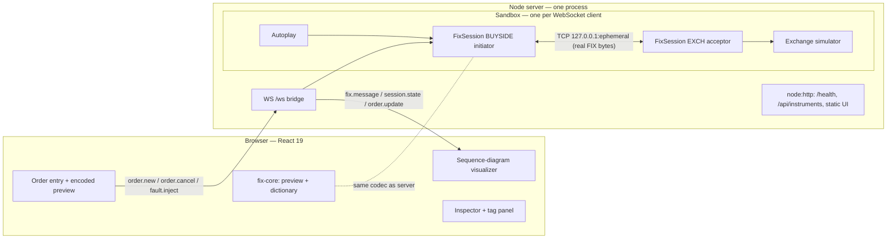
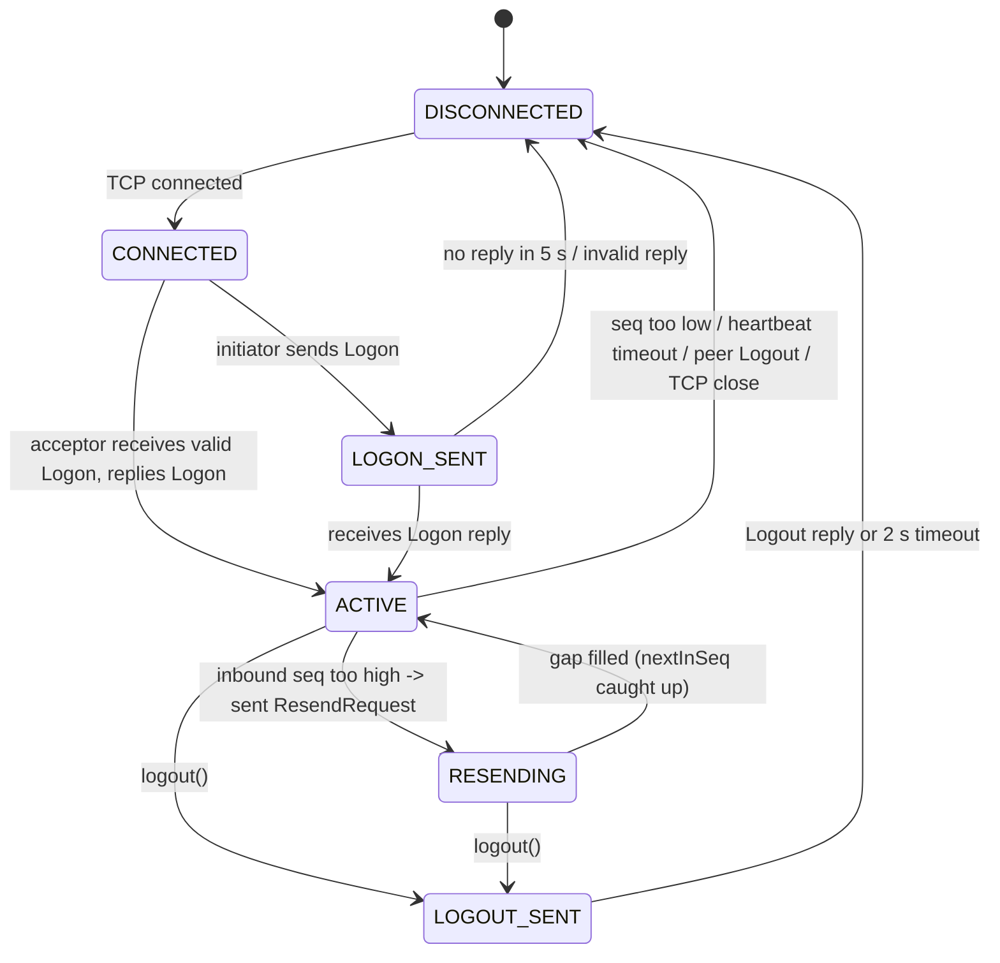

# Architecture

**Product:** FIX Protocol Lab  
**Version:** 1.0

---

## 1. Components



| Component | Responsibility |
|-----------|----------------|
| `fix-core` | Bytes ↔ `FixMessage`, BodyLength/CheckSum, framing, **version registry** and per-version dictionaries. No I/O. |
| `fix-session` | Session state machine, sequence numbers, heartbeats, TestRequest, resend/gap fill, faults. Transport-agnostic core + TCP adapter. |
| Sandbox | Creates the acceptor listener on `127.0.0.1:0`, connects the initiator, wires both sessions' `wire` events to the bridge, tears everything down on close. |
| Exchange simulator | Version-neutral order logic per §6. Talks FIX through the sandbox version's **dialect** (§12). |
| Bridge | Maps session and exchange events to the JSON events in API_CONTRACT §5; validates client commands; enforces rate and capacity limits. |
| Web UI | Renders the stream; never speaks FIX itself. It uses `fix-core` only to show a live encoded preview and tag meanings. |

---

## 2. Codec internals

### Encode

1. Serialize the body: `35=<type>` + SOH, then each field `tag=value` + SOH in order.
2. `9` = byte length of that body.
3. Header = `8=<profile.beginString>` SOH `9=<len>` SOH.
4. CheckSum = (sum of bytes of header + body) mod 256, zero-padded to 3 digits.
5. Append `10=<nnn>` SOH.

### Decode

1. Split on SOH; each field must match `^[1-9][0-9]*=[^\x01]+$`.
2. Validate order (8, 9, 35 first; 10 last), then recompute BodyLength and CheckSum over the actual bytes.
3. Return `fields` excluding 8, 9, 35 and 10, in wire order.

### Framer (TCP stream → messages)

```
buffer += chunk
loop:
  i = indexOf("8=" + <any registered BeginString> + "\x019=")   # resync point
  if i < 0: keep the last 12 bytes, stop  # a prefix may be split
  drop bytes before i (count as garbage)
  parse digits after "9=" up to SOH -> L  (need more bytes? stop)
  end = position after that SOH + L + len("10=nnn\x01")
  if buffer shorter than end: stop (wait for more)
  if bytes at end-7 .. end are not "10=ddd\x01": emit raw anyway (decode will flag it), advance
  emit buffer[i:end]; buffer = buffer[end:]
```

The framer never validates the checksum. That is `decode`'s job, so the session can report a garbled message instead of losing it silently.

---

## 3. Session state machine



Logon rules:
- The first inbound message on a new connection MUST be Logon (A); anything else → disconnect without a reply.
- The acceptor checks `56` equals its own CompID and `49` equals the expected peer. On a mismatch it sends Reject (373=9), then Logout, then disconnects.
- Both sides send `141=Y` (ResetSeqNumFlag): each Logon starts both sequences at 1. The demo never needs to recover across reconnects, only inside a live session, which is where gaps are interesting.
- The acceptor echoes the initiator's HeartBtInt (108).

---

## 4. Sequence number rules (normative)

Each session keeps `nextOutSeq` (next MsgSeqNum it will send) and `nextInSeq` (the MsgSeqNum it expects next). Both start at 1 after Logon.

| Inbound MsgSeqNum vs `nextInSeq` | PossDupFlag (43) | Action |
|---|---|---|
| equal | any | Process; `nextInSeq += 1` |
| higher | any | **Do not process.** If not already RESENDING, send ResendRequest `7=<nextInSeq>`, `16=0` (all subsequent) and enter RESENDING. Later messages above the gap are also discarded, because the peer's replay (16=0) re-sends them. |
| lower | `Y` | Duplicate: ignore silently |
| lower | absent/`N` | Send Logout `58=MsgSeqNum too low, expecting <n> but received <m>`, then disconnect |

Special cases:
- **SequenceReset-GapFill** (`123=Y`) with `34 = nextInSeq`: set `nextInSeq = 36` (NewSeqNo). If NewSeqNo ≤ `nextInSeq`, send Reject (373=5, "value is incorrect") and don't change the sequence.
- **SequenceReset-Reset** (`123=N`/absent): ignore the MsgSeqNum check and set `nextInSeq = 36` if it's higher; if lower, send Reject.
- **Logon** reply: processed at seq 1 because of `141=Y`.
- A well-formed message missing a required header tag → Reject 3 with `45`=its seq, `373=1` (required tag missing), `371`=tag; `nextInSeq += 1`.
- A **garbled** message (bad BodyLength or CheckSum, or undecodable) is dropped **without** incrementing `nextInSeq` and without a Reject. The next good message will then look "too high" and trigger normal gap recovery.

### Answering a ResendRequest (sender side)

Given `7=B`, `16=E` (`E=0` → last sent seq), walk the outbound store from B to E:

- **Application message** → resend with the same `34`, `43=Y`, `122=<original 52>`, and a new `52`.
- **Admin message** (A, 0, 1, 2, 3, 4, 5) or a missing store entry → consecutive runs collapse into **one** SequenceReset-GapFill: `34=<first seq in run>`, `43=Y`, `122`, `123=Y`, `36=<seq after run>`.
- New messages generated during the replay wait in an outbound queue until the replay finishes, so sequence numbers stay monotonic on the wire.

When `nextInSeq` catches up past the requested range, the requester leaves RESENDING and returns to ACTIVE.

---

## 5. Heartbeats and TestRequest

Let `H` = HeartBtInt (108), in seconds.

| Timer | Fires when | Action |
|---|---|---|
| Outbound idle | nothing sent for `H` | Send Heartbeat (0) |
| Inbound idle | nothing received for `H × 1.2` | Send TestRequest (1) `112=TEST-<n>` |
| TestRequest wait | still nothing received `H` after the TestRequest | Disconnect, reason `heartbeat timeout` |

- A TestRequest is answered immediately by a Heartbeat that echoes `112`.
- Any inbound message counts as "received" and resets the inbound timer.

### Faults (fix-session `faults.ts`)

| Kind | Effect | What the viewer sees |
|---|---|---|
| `drop_next` | The next outbound message is encoded and **consumes** its MsgSeqNum, but isn't written to the socket (`wire` event with `dropped=true`). | Peer detects a gap on the following message → ResendRequest → GapFill or PossDup resend → back to ACTIVE. |
| `corrupt_next_checksum` | The next outbound message is written with CheckSum + 1 (mod 256). | Peer logs "garbled: BAD_CHECKSUM (ignored)"; the next message triggers gap recovery exactly like `drop_next`. |
| `pause_heartbeats` | Suppresses **regular** heartbeats for `2 × H`, but still answers TestRequests. | Peer's inbound timer fires → TestRequest → Heartbeat with matching `112` → no disconnect. |

---

## 6. Exchange simulator (normative fill model)

Instruments come from config: `DEMO` refPx `101.00`, `ACME` refPx `50.00` (static in v1).

On **NewOrderSingle (D)**:
1. Unknown symbol → ExecutionReport `150=8`, `39=8`, `58=Unknown symbol`.
2. Otherwise → ExecutionReport **New** (`150=0`, `39=0`, `151=qty`, `14=0`, `6=0`), with OrderID `EX-<n>` and ExecID `EXEC-<n>`, both counting up per sandbox.
3. **Crossing test:** MARKET orders always cross; a LIMIT BUY crosses if `44 ≥ refPx`; a LIMIT SELL crosses if `44 ≤ refPx`.
4. If it crosses, schedule fills at `LastPx = refPx`:
   - `qty ≥ 2`: first fill `floor(qty/2)` after **250 ms** (`150=F`, `39=1`), remainder after **500 ms** (`150=F`, `39=2`).
   - `qty = 1`: a single fill after 250 ms (`39=2`).
   - Each fill sets `31`, `32`, `14`, `151`, `6` (AvgPx rounded to 4 decimals).
5. Non-crossing orders rest indefinitely until cancelled.

On **OrderCancelRequest (F)**:
- Working order (`39` ∈ {0, 1}, `151 > 0`) → cancel pending fills; ExecutionReport `150=4`, `39=4`, `41=<orig>`, `151=0`.
- Filled or already cancelled → OrderCancelReject (9) `102=0` "Too late to cancel".
- Unknown OrigClOrdID → OrderCancelReject (9) `102=1` "Unknown order".

All timing uses the session `Clock`, so tests advance fake time instead of sleeping.

---

## 7. Sandbox lifecycle and bridge

```
ws connect
  -> capacity check (MAX_SANDBOXES) -> else error CAPACITY + close 1013
  -> listenAcceptor(127.0.0.1:0, EXCH) ; connectInitiator(port, BUYSIDE) ; BUYSIDE.logon()
  -> send hello; forward every wire/state/order event as JSON
ws message -> validate -> map to session.send / cancel / injectFault / autoplay
ws close or idle timeout -> BUYSIDE.logout() -> close sockets + listener -> free slot
```

Bridge mapping for `fix.message`:
- `out` events come from the sender's session and `in` events from the receiver's, so the UI can draw an arrow when both arrive, or a broken arrow ending in ✕ when `dropped=true` or the receiver notes it as garbled.
- `id` is `m_<n>`, unique per sandbox, so the UI can pair `out` and `in` by `(from, seq, possDup)`.

---

## 8. Worked examples (canonical)

All examples use `H = 30` for readability; the demo defaults to 10 s. The raw messages are the golden vectors A1–B5 in API_CONTRACT §1.3.

### A — Logon and a filled order

Delivery takes 1 ms in each direction (API_CONTRACT §1.3).

| # | Time | From → To | Seq | Message (vector) |
|---|------|-----------|-----|---------|
| 1 | 10:00:00.000 | BUYSIDE → EXCH | 1 | Logon `98=0 108=30 141=Y` (A1) |
| 2 | 10:00:00.001 | EXCH → BUYSIDE | 1 | Logon reply (A2). Both sides ACTIVE, `nextInSeq=2` |
| 3 | 10:00:05.000 | BUYSIDE → EXCH | 2 | NewOrderSingle `11=ORD-1 55=DEMO 54=1 38=100 40=2 44=101.25` (A3) |
| 4 | 10:00:05.001 | EXCH → BUYSIDE | 2 | ExecutionReport New `37=EX-1 150=0 39=0 151=100` (A4) |
| 5 | 10:00:05.251 | EXCH → BUYSIDE | 3 | ExecutionReport Trade `150=F 39=1 32=50 31=101.00 14=50 151=50` |
| 6 | 10:00:05.501 | EXCH → BUYSIDE | 4 | ExecutionReport Trade `150=F 39=2 32=50 31=101.00 14=100 151=0 6=101.00` |

The buy limit 101.25 is ≥ refPx 101.00, so it crosses and fills at the reference price 101.00.

### B — Dropped message and gap recovery

Continuing from A. BUYSIDE last sent at 10:00:05.000, so its idle Heartbeat is due at 10:00:35.000. EXCH last sent at 10:00:05.501, so its Heartbeat isn't due until 10:00:35.501, after the recovery below.

| # | Time | From → To | Seq | Message (vector) |
|---|------|-----------|-----|---------|
| 7 | 10:00:20 | — | — | Visitor injects `drop_next` on BUYSIDE |
| 8 | 10:00:35.000 | BUYSIDE → ✕ | 3 | Heartbeat — **dropped**, but it still consumes seq 3 (B1) |
| 9 | 10:00:35.400 | BUYSIDE → EXCH | 4 | NewOrderSingle `ORD-2` sell 10 @ 102.00. EXCH expected 3, got 4 → **not processed** (B2) |
| 10 | 10:00:35.401 | EXCH → BUYSIDE | 5 | ResendRequest `7=3 16=0`; EXCH enters RESENDING (B3) |
| 11 | 10:00:35.402 | BUYSIDE → EXCH | 3 | SequenceReset-GapFill `43=Y 122=…35.000 123=Y 36=4`, because seq 3 was admin (B4) |
| 12 | 10:00:35.402 | BUYSIDE → EXCH | 4 | `ORD-2` resent with `43=Y 122=…35.400` (B5) |
| 13 | 10:00:35.403 | EXCH | — | Applies the GapFill (`nextInSeq=4`), processes `ORD-2` (`nextInSeq=5`) and returns to ACTIVE |
| 14 | 10:00:35.403 | EXCH → BUYSIDE | 6 | ExecutionReport New for `ORD-2`. It rests, because sell 102.00 > refPx 101.00 |

### C — Paused heartbeats and TestRequest

`pause_heartbeats` on BUYSIDE → EXCH receives nothing for 36 s (`30 × 1.2`) → EXCH sends TestRequest `112=TEST-1` → BUYSIDE answers Heartbeat `112=TEST-1` → EXCH's timers reset, and there is no disconnect.

### D — Corrupted checksum

`corrupt_next_checksum` on BUYSIDE → its next message arrives with a wrong `10`. EXCH reports `garbled: BAD_CHECKSUM (ignored)` and doesn't increment `nextInSeq`. BUYSIDE's following message is "too high", and recovery proceeds exactly as in B.

These four examples MUST be covered by tests (TEST_PLAN §4) and SHOULD be available as UI scenarios (`?scenario=happy-path|gap-recovery|test-request|bad-checksum`).

---

## 9. UI architecture

| Slice (RTK) | Holds |
|---|---|
| `connection` | WS status, `hello` payload, reconnect backoff |
| `session` | Per-side state, `nextOutSeq`/`nextInSeq`, last reason |
| `messages` | Ordered `fix.message` events (cap 2,000; oldest evicted) plus a selected message id |
| `orders` | Blotter keyed by ClOrdID from `order.update` |
| `ui` | Filters (hide admin, hide heartbeats), paused flag, selected tag |

- A **WebSocket listener middleware** owns the socket and dispatches actions; components never touch the socket.
- **RTK Query** handles REST (`/health`, `/api/instruments`).
- The **visualizer** has two vertical lifelines (BUYSIDE, EXCH). Each message is one row with an arrow in its direction, labelled `35=<type> <name> #<seq>`. Admin messages are muted, app messages emphasized, PossDup dashed, and dropped or garbled messages end in ✕. It auto-scrolls unless paused and keeps up to 2,000 rows (virtualized).
- The **inspector** shows the raw bytes with each `tag=value` as a clickable token, plus a table of tag, name, value and meaning. Clicking a tag opens the **tag panel** (from `fix-core` `TAGS`).
- The **order form** calls `fix-core.encode` on every keystroke to show the NewOrderSingle the server will send (with placeholder header values), highlighting BodyLength and CheckSum changing.

---

## 10. Complexity notes

| Operation | Cost |
|---|---|
| Encode/decode | O(n) in message bytes |
| Framer push | Amortized O(n) per byte (buffer compaction on emit) |
| Resend of k messages | O(k) over the in-memory store |
| Bridge fan-out | O(1) per event (one client per sandbox) |

## 11. Explicit non-architecture

- No message store persistence, no cross-process sessions, no public FIX port
- No matching between visitors: each sandbox's exchange is independent
- No repeating-group semantics; versions beyond 4.4 are added through §12, not special-cased

---

## 12. FIX versions (pluggable profiles)

FIX Protocol Lab aims to show **every** FIX version working live. The design makes a version a unit of work, not a refactor.

### What varies between versions

| Concern | Where it lives | Example differences |
|---|---|---|
| BeginString, ApplVerID | `FixVersionProfile` | `FIX.4.2` / `FIX.4.4`; FIX 5.x sends `8=FIXT.1.1` plus `1128`/`1137` ApplVerID |
| Tags, enums, message types | `FixDictionary` per version, built with `defineDictionary(base, overrides)`, so 4.3 extends 4.2 and 4.4 extends 4.3 | 4.2 has ExecTransType (20); 4.3+ drop it. ExecType fills are `1`/`2` in 4.2 and `F` in 4.3+ |
| Session details | `profile.session` (extra Logon fields, admin types) | FIXT Logon adds DefaultApplVerID (1137) |
| Order message shapes | `apps/server/src/dialects/<id>.ts` implementing `OrderDialect` | How an ExecutionReport for a fill is expressed |

What does **not** vary, and stays version-neutral: codec byte rules (9/10), framing, sequence numbers, heartbeats, TestRequest, resend and gap fill, fault injection, the WS bridge and the UI.

### `OrderDialect` (server)

```ts
interface OrderDialect {
  readonly versionId: string;
  newOrderSingle(o: NewOrder): FixField[];           // body fields for 35=D
  cancelRequest(c: CancelRequest): FixField[];         // 35=F
  executionReport(e: ExecEvent): FixField[];           // 35=8 (new / fill / cancel / reject)
  cancelReject(r: CancelReject): FixField[];           // 35=9
  parseExecutionReport(m: FixMessage): OrderUpdate;    // for the blotter
}
```

The exchange simulator emits **version-neutral** `ExecEvent`s (`new`, `fill`, `canceled`, `rejected`). The dialect turns them into fields. Adding a version never touches `exchange.ts`.

### Adding a version (checklist)

1. `packages/fix-core/src/versions/<id>/`: `profile.ts` and `dictionary.ts` (derived from the nearest implemented version). Flip `status` from `planned` to `implemented`.
2. `apps/server/src/dialects/<id>.ts`, plus registration in the dialect map.
3. Golden vectors for that version in API_CONTRACT (a new §1.3 subsection), generated and verified byte for byte.
4. Tests: `codec round-trips <id> golden vectors`, `session logs on and recovers a gap in <id>`, `exchange flow in <id> produces valid execution reports`.
5. README and version picker copy (one-line `summary`).

### Version roadmap

| Order | Version | BeginString | Notes |
|---|---|---|---|
| v1 | FIX 4.4 | `FIX.4.4` | Implemented first; most common in production |
| next | FIX 4.2 | `FIX.4.2` | Still widespread; ExecTransType and old ExecType semantics make a good contrast |
| then | FIX 4.3 | `FIX.4.3` | Bridge between 4.2 and 4.4 |
| then | FIX 5.0 SP2 | `FIXT.1.1` + ApplVerID `9` | Session/application split (FIXT); shows transport independence |

Planned versions are registered with `status: "planned"` from day one, so the picker shows the roadmap, but they can't be selected, and `decode` rejects their BeginString until they're implemented.
