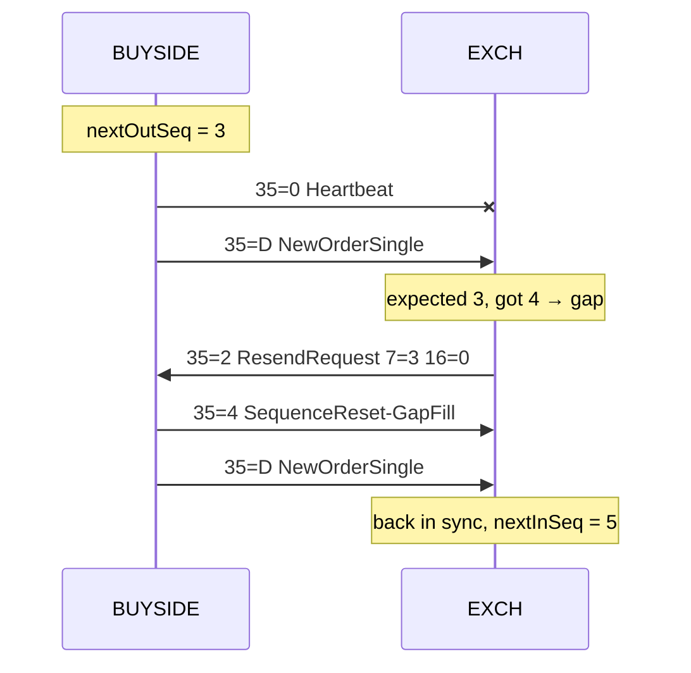

# How the FIX session layer keeps two firms in sync

*A walk through the part of FIX that nobody sees, with the exact bytes from FIX Protocol Lab.*

When people say they "know FIX", they usually mean the message format: `35=D` is a new order, `54=1` is a buy, `44=` is the price. That's the easy half. The half that decides whether a trading connection survives a bad day is the **session layer**. It numbers every message, notices when one goes missing, and repairs the gap without anyone being paged.

This write-up explains that layer from first principles, using real messages captured from FIX Protocol Lab's engine. Every byte shown here comes from a test that reproduces it exactly. `|` stands in for the invisible SOH byte (`0x01`) that separates fields.

---

## 1. Why FIX needs its own session layer at all

FIX runs over TCP, and TCP already guarantees ordered, reliable delivery, so why add another layer?

Because TCP only guarantees delivery **within one connection**, and only to the other side's **kernel**, not to its application. Connections drop. Processes restart. An order can be written to a socket that dies a millisecond later, and the sender can't tell whether it arrived. In trading, "maybe it arrived" isn't acceptable: an order that was received but never acknowledged, or acknowledged twice, is real money.

So FIX gives each side its own bookkeeping on top of TCP:

- **Every message has a sequence number** (`34=MsgSeqNum`), counted independently in each direction.
- **Each side knows which number it expects next**, so a missing message shows up as a gap.
- **Either side can ask for a replay** of a range of messages, and the other side keeps what it sent so it can answer.
- **Heartbeats** prove the other side is alive, even when there's no business to send.

---

## 2. Logon: agreeing on the rules

A session starts when the **initiator** (here BUYSIDE, the firm sending orders) connects and sends a Logon:

```
8=FIX.4.4|9=72|35=A|49=BUYSIDE|56=EXCH|34=1|52=20260924-10:00:00.000|98=0|108=30|141=Y|10=083|
```

Reading it field by field:

| Field | Meaning |
|---|---|
| `8=FIX.4.4` | Protocol version. Always first. |
| `9=72` | BodyLength: the number of bytes from `35=` up to the delimiter before `10=`. |
| `35=A` | MsgType: Logon. |
| `49` / `56` | SenderCompID / TargetCompID: who's talking to whom. |
| `34=1` | MsgSeqNum: this is BUYSIDE's first message. |
| `52` | SendingTime, in UTC with milliseconds. |
| `108=30` | HeartBtInt: "if you hear nothing from me for 30 seconds, something is wrong". |
| `141=Y` | ResetSeqNumFlag: both sides start counting at 1. |
| `10=083` | CheckSum: the sum of every preceding byte, modulo 256. Always last. |

The **acceptor** (EXCH) checks that the CompIDs are the ones it expects, adopts the heartbeat interval and replies with its own Logon. Its sequence number is also 1, because each direction has its own counter:

```
8=FIX.4.4|9=72|35=A|49=EXCH|56=BUYSIDE|34=1|52=20260924-10:00:00.001|98=0|108=30|141=Y|10=084|
```

Two rules the engine enforces here:

- **The first message on a connection must be a Logon.** Anything else and the acceptor drops the connection without replying. It doesn't know who it's talking to yet.
- **Wrong CompIDs get a Reject** (`35=3`, `373=9` "CompID problem"), then a Logout, then a disconnect.

---

## 3. Two counters per side

After logon, each side tracks two numbers:

- `nextOutSeq`: the MsgSeqNum it will put on its next outgoing message.
- `nextInSeq`: the MsgSeqNum it **expects** on the next incoming message.

Every incoming message is compared with `nextInSeq`, and there are only three cases:

| Incoming MsgSeqNum | What it means | What the engine does |
|---|---|---|
| **equal** | Exactly what we expected | Process it and move `nextInSeq` on by one |
| **higher** | We missed something | Don't process it. Send a **ResendRequest** and enter RESENDING |
| **lower**, with `43=PossDupFlag=Y` | A duplicate the sender warned us about | Ignore it quietly |
| **lower**, without PossDup | The other side's numbering has gone backwards | Log out with a reason and disconnect |

The last row surprises people: why hang up instead of just ignoring it? Because a sequence number that goes backwards without the PossDup warning means the two sides disagree about history, for example after one side restored an old state. Carrying on would risk processing the same order twice or not at all. FIX prefers a loud failure to a silent one.

---

## 4. Heartbeats and TestRequest: is anyone there?

A quiet session and a dead session look the same from the outside, so each side runs two timers based on HeartBtInt (H):

1. **Outbound idle.** If this side hasn't *sent* anything for H seconds, it sends a Heartbeat (`35=0`).
2. **Inbound idle.** If it hasn't *received* anything for about 1.2 × H (a little grace for network delay), it sends a **TestRequest** (`35=1`) with an identifier such as `112=TEST-1`.

A TestRequest is a direct question: "answer me now". The other side must reply immediately with a Heartbeat that echoes the same `112=TEST-1`. If no answer arrives within another H seconds, the connection is declared dead and dropped.

In the lab, **Go quiet** pauses BUYSIDE's regular heartbeats (but not its answers to TestRequests). You'll see EXCH notice the silence, send a TestRequest, and get the matching Heartbeat back. The session survives, which is the point: TestRequest separates "quiet" from "gone".

---

## 5. Losing a message and getting it back

This is the heart of the session layer. Here is the lab's **Lose a message** scenario, with the actual bytes.



**Step 1: a message disappears.** BUYSIDE's heartbeat, sequence 3, is sent but never arrives:

```
8=FIX.4.4|9=54|35=0|49=BUYSIDE|56=EXCH|34=3|52=20260924-10:00:35.000|10=006|
```

The lost message still **consumed** number 3. BUYSIDE's counter moved on, because as far as it's concerned the message was sent.

**Step 2: the gap shows up.** BUYSIDE's next message is an order, sequence 4:

```
8=FIX.4.4|9=127|35=D|49=BUYSIDE|56=EXCH|34=4|52=20260924-10:00:35.400|11=ORD-2|55=DEMO|54=2|60=20260924-10:00:35.400|38=10|40=2|44=102.00|59=0|10=036|
```

EXCH expected 3 and received 4. It **does not process the order**, even though the order itself is fine. Processing messages out of order is exactly the kind of silent inconsistency the session layer exists to prevent.

**Step 3: ask for everything from the gap onward.**

```
8=FIX.4.4|9=63|35=2|49=EXCH|56=BUYSIDE|34=5|52=20260924-10:00:35.401|7=3|16=0|10=140|
```

`7=3` is BeginSeqNo, and `16=0` means "and everything after it". Asking for everything, rather than just message 3, means EXCH never has to buffer out-of-order messages: the replay will re-deliver message 4 as well.

**Step 4: the replay, with two different treatments.** BUYSIDE walks through what it sent from 3 onward:

- **Message 3 was a Heartbeat, an admin message.** Resending an old heartbeat would be pointless: it was only ever about "I'm alive *right now*". So instead of the heartbeat, BUYSIDE sends a **SequenceReset-GapFill** that says "skip to 4":

  ```
  8=FIX.4.4|9=96|35=4|49=BUYSIDE|56=EXCH|34=3|52=20260924-10:00:35.402|43=Y|122=20260924-10:00:35.000|123=Y|36=4|10=016|
  ```

  It carries the skipped message's own sequence number (`34=3`), `123=Y` (GapFillFlag) and `36=4` (NewSeqNo). Several consecutive admin messages collapse into a single GapFill.

- **Message 4 was an order, an application message.** Business messages must never be silently skipped, so it is sent again with the same sequence number, marked as a possible duplicate:

  ```
  8=FIX.4.4|9=158|35=D|49=BUYSIDE|56=EXCH|34=4|52=20260924-10:00:35.402|43=Y|122=20260924-10:00:35.400|11=ORD-2|...|10=032|
  ```

  `43=Y` (PossDupFlag) warns the receiver it may have seen this before. `122` (OrigSendingTime) keeps the original timestamp, while `52` is the new send time.

**Step 5: back in sync.** EXCH applies the GapFill (now expecting 4), processes the order (now expecting 5), sees it has caught up with the highest number it saw, and leaves RESENDING. The order is acknowledged exactly once.

A subtle rule makes this safe while live traffic continues: **new messages created during the replay wait** until the replay has finished, so sequence numbers on the wire never go backwards.

---

## 6. When the bytes themselves are wrong

**Corrupt a checksum** shows a different failure: the message arrives, but damaged. FIX's rule is that a message with a bad BodyLength or CheckSum is **garbled**, and garbled messages are simply **ignored**. There's no Reject, and crucially the expected sequence number doesn't advance, because a damaged message can't be trusted to tell you what its sequence number was.

That turns corruption into the case we've already solved. The next good message arrives "too high", and the normal resend recovery repairs the gap. One mechanism handles both lost and damaged messages.

Compare that with a message that decodes perfectly but breaks a rule, such as a missing SendingTime (`52`). That gets a session-level **Reject** (`35=3`, `373=1` "required tag missing"), and its sequence number *is* consumed, because the receiver could read it; it just refuses it.

---

## 7. Why the implementation is shaped the way it is

A few design choices in FIX Protocol Lab's engine are worth calling out:

- **Transport-agnostic core.** `FixSession` only sees a byte transport with `write`, `onData` and `onClose`. In production that's a TCP socket on loopback; in tests it's an in-memory pipe. The session logic never knows the difference.
- **An injectable clock.** Every timer (heartbeats, TestRequests, logon and logout timeouts) goes through a `Clock`. Tests use a manual clock, so a whole 35-second recovery scenario runs in microseconds and is fully deterministic. The golden messages above are **reproduced byte for byte** by the test suite, timestamps and checksums included.
- **Faults are a first-class feature, not a test hack.** "Drop next", "corrupt next checksum" and "pause heartbeats" are part of the engine, because the whole point of the lab is to watch recovery happen.
- **Versions are profiles.** BeginString, dictionaries, extra Logon fields and order-message shapes live in a per-version profile. The session rules above are the same in FIX 4.2, 4.3, 4.4 and FIXT.1.1 (FIX 5.0 SP2), and the tests replay the gap recovery in each one. The only session-level difference is that a FIXT Logon must agree DefaultApplVerID (`1137=9`); the acceptor rejects a Logon without it.

---

## 8. What a production engine adds

This engine is deliberately small. To run real money you would also need:

- **A persistent message store**, so a resend request can be answered after a restart, and **sequence-number persistence** across reconnects (here every Logon resets to 1 with `141=Y`).
- **Session schedules** (start and end times, daily resets) and **authentication**.
- **TLS**, throttling, and admin tooling for manual sequence resets.
- Full **repeating-group** handling and certification against each counterparty's rules of engagement.

That's what QuickFIX/J and commercial engines provide. The goal here is different: to make the protocol's core ideas — sequence numbers, heartbeats, TestRequest, resend, gap fill, PossDup — visible enough that you only have to see them once to remember them.

Try it yourself: open the lab, click **Lose a message**, and watch sections 5 and 6 play out live.
